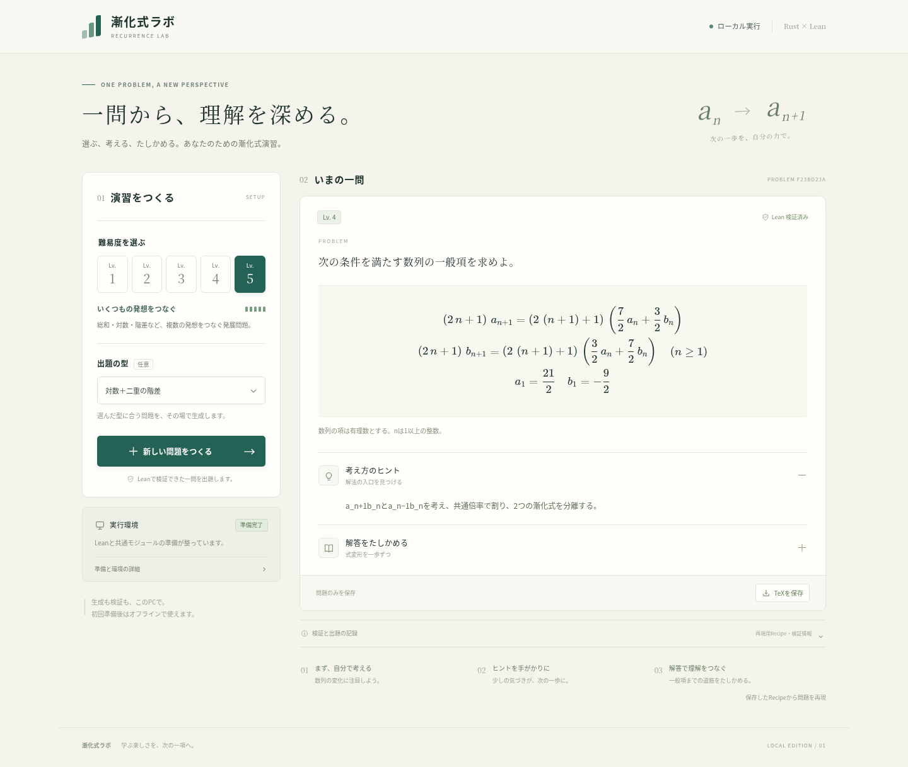

# 検証結果

## v0.3.0のブラウザー単独版

Rust/WebAssemblyのリリースビルドと厳密計算APIのテストが成功しました。ネイティブ版とブラウザー機能を合わせた通常テスト30件、rustfmt、全ターゲットの厳格なclippy、WASMターゲットの依存分離を確認しています。Recipeのseedは数値・文字列の両形式を受け付け、ブラウザー版とLean版の間でも精度を保って受け渡せます。

単一HTMLをChromiumで読み込み、ブラウザーをオフラインにして28系統を生成し、参照版と照合済みの75構成を再現しました。問題ID・問題式・一般項・教育スコアがネイティブ版と一致しました。ヒントと解答の独立開閉、解答開閉に応じたTeX保存、Recipe保存・再現、64ビットseedの精度、改変拒否、中止、幅1440px・390pxを確認しました。演習中のHTTP要求とJavaScript例外は0件でした。

この実行環境ではChromiumの管理ポリシーが`file://`への移動を禁止しているため、許可されたループバックの静的配信でHTMLを読み込んだ後、生成前に通信を無効にしました。生成APIやRustサーバーは使用していません。さらに[GitHub Actionsの実行](https://github.com/mas256/recurrence-equation-generator/actions/runs/37867430564)で、単一HTMLを別の一時フォルダーへ移し、オフラインのChromiumから`file://`で直接開く同じ検査が成功しました。分割版と最上位の入口HTMLの直接起動も成功しました。Rustのテスト・clippy・WASMチェックのジョブも成功しています。

ブラウザーでの数学的な確認は、一般項の初期条件とn=1〜20の漸化式・定義域条件の厳密計算です。全添字の形式証明は実行しません。生成時にLeanの証明済み表示を使わず、以下の従来版のLean検証実績と区別します。ブラウザー版で保存する文字列seedのRecipeをネイティブAPIに読み込ませ、内容IDを保持してLeanの必須4定理を検証できることも確認しました。実行概要は[browser-validation.json](browser-validation.json)に保存しています。

再実行例:

```bash
cargo test --locked --features browser
cargo clippy --locked --all-targets --features browser -- -D warnings
python3 scripts/build-browser.py
npm run test:offline
```

管理ポリシーでファイル起動が禁止される開発環境では`RECURRENCE_TEST_STATIC_PREVIEW=1 npm run test:offline`を使用します。開発と配布手順は[ブラウザー版の説明](browser.md)を参照してください。

## v0.2.0のRust＋Lean版の検証実績

検証日：2026年10月9日（日本時間）。アプリ版0.2.0、Lean 4.19.0、固定したmathlibと共通定理を使用しました。

## 実施した確認

|確認|結果|
|---|---|
|Rust通常テスト|24件成功。28系統の厳密計算・Recipe再現、登録倍率、初期条件、前向き分類、改変拒否、内容ID、教材出力を確認|
|Clippy|全ターゲットを警告をエラーとして検査し成功|
|Lean|28系統すべてで、初期条件・全添字の漸化式・一意性・必要な定義域条件の4定理を検証。改変・時間切れ・中止の異常系も成功扱いしないことを確認|
|構成の検証|各追加モジュールで倍率・付加項・指数の登録構成を検証。初版7構成と追加68構成の計75構成を扱う。指数型では振幅1・3/2・8/5と追加の種もLeanで確認|
|参照版との照合|固定コミットa21c3d0711ebb08d0516e646f32ee3cab7b2c7deのv0.7.0と750例を照合。28系統・75構成の初期条件、20項の一般項、任意の3通りの入力で各漸化式、教育スコア・Lv、参照版の品質判定が一致|
|ブラウザー|28系統の選択、生成・同時要求拒否・中止・再現、連立の両式と両一般項、部分和の境界、二項係数・対数の数式、TeXの解答開閉を確認|
|画面と通信|幅1440px・390pxで、画面の横方向のはみ出し、数式描画エラー、JavaScript例外、資産の外部通信がないことを確認|

公理監査ではpropext、Classical.choice、Quot.soundのみを許可します。必須定理4件、終了コード0、問題・証明・環境のハッシュを対応付けます。有限項の照合は移植の検査であり、全項の数学的な証明はLeanで別に行います。

概要は[validation-summary.json](validation-summary.json)、参照照合の系統・構成別記録は[reference-parity.json](reference-parity.json)に保存しました。再実行には`cargo test --locked`、`cargo clippy --all-targets -- -D warnings`、準備後の`cargo test --test lean -- --ignored --nocapture`を使用します。各構成のLeanテストは`cargo test --lib -- --ignored --nocapture`で実行できます。

参照照合の再実行例（Pythonと固定参照版は開発用）:

```bash
cargo run --locked --example export-fixtures -- 10 > /tmp/fixtures.json
python3 scripts/check-reference.py /path/to/math-textbooks /tmp/fixtures.json
```

## 準備済み環境の計測

各系統を対応する全Lvで指定した32件と、総合演習を各Lv10問ずつ生成した50問がすべて成功しました。計82件で失敗・時間切れ・中止は0件です。系統指定の32件は28系統を網羅し、問題・検証ハッシュ、指定Lv、必須4定理の監査を各要求で確認しました。

|対象|中央値|95パーセンタイル|最大|
|---|---:|---:|---:|
|要求全体・50問|2.150秒|2.666秒|2.954秒|
|Lean検証・50問|1.931秒|2.534秒|2.774秒|
|系統指定32件・要求全体|2.147秒|2.705秒|2.940秒|
|Lv1・要求全体|1.883秒|2.211秒|2.211秒|
|Lv2・要求全体|2.172秒|2.202秒|2.202秒|
|Lv3・要求全体|2.167秒|2.698秒|2.698秒|
|Lv4・要求全体|2.148秒|2.954秒|2.954秒|
|Lv5・要求全体|2.187秒|2.666秒|2.666秒|

計測環境はLinux 6.18.44 x86_64、CPU表示はAMD EPYC 9V74 80-Core Processor、報告されたメモリ総量は10207516KiBです。クラウド環境での直列要求で、初回取得・共通コンパイルは含みません。要求時間にはクライアントの確認間隔を含みます。利用者PCの性能を保証する値ではありません。

[50問の集計](benchmark-summary.json)・[実行環境](benchmark-environment.json)、[系統指定の集計](benchmark-family-summary.json)・[実行環境](benchmark-family-environment.json)を同梱しています。生の要求別記録は実行時のtest-resultsフォルダーに保存されます。

```bash
bash scripts/benchmark.sh http://127.0.0.1:3210 1 test-results/families families
bash scripts/benchmark.sh http://127.0.0.1:3210 10 test-results/benchmark
```

## 配布と対応範囲

Linux x86_64実行ファイルは4,849,856バイトで、glibc 2.39以上を使用します。以前のglibcでは同梱ソースからRustでビルドしてください。ZIPにはソース、数式資産、固定したLean設定、準備・起動スクリプト、検証資料を含めます。Linux版には実行ファイルも同梱します。Lean・mathlibの取得済み環境、生成履歴は含めません。

初回は`bash scripts/setup-lean.sh`、起動は`bash scripts/start.sh`を実行します。準備後のアプリにはPythonや外部サーバーが不要です。配布ZIPのサイズとSHA-256はdist/artifact-manifest.jsonに記録します。開発環境では`cargo build --release --locked`の後に`python3 scripts/package.py`でZIPを再作成できます。

参照版の全倍率、任意のブロック合成、実数値の任意数列、複数解法、macOS・Windowsネイティブの実機確認は含めません。広いパラメータを指定したRecipeでは、参考実装の別解より品質判定が厳しい場合があります。規則版1.0の保存済み重み付き総和Recipeは再現互換の例外を保持します。詳しい範囲は[実装状況](implementation-status.md)に記載しています。TeXの内容・体裁は確認しましたが、pLaTeXによるPDF組版は未確認です。



[スマートフォン幅390pxの画面](mobile-preview.png)
